<h3 align="center">▶︎ •|l|l|l|l|l|• 0:10 ˙ 𐙚 Jamming Session</h3>
<p align="center">
  <a href="https://spotify-widget-lemon.vercel.app/api/orchestrator/redirect" target="_blank">
    
  </a>
</p>

---

<div align="center">
  <p align="center">
    <code>✧･ﾟ: *✧･ﾟ:* (,,> ᴗ <,,) *:･ﾟ✧*:･ﾟ✧</code>
  </p>
  
</div>

<br>

<h3 align="center">꒰ᐢ. .ᐢ꒱ ₊˚ Playroom Dynamics</h3>
<div align="center">

| ૮₍´˶• . • ⑅₎ა Role & Dynamic | —୨୧— The Lair | ✦ Instruments & Core Stack ✦ | ‹* Safeword *› |
| :---: | :---: | :---: | :---: |
| Switch / Full-Stack & Desktop | My cozy sanctuary (,,> ᴗ <,,) | C#/WPF, TypeScript, Laravel & Filament | `Ctrl + Z` ✧ |

</div>

<br>

<h3 align="center">₍ᐢ. .ᐢ₎ ˙ 𐙚 The Playpen (Battle Station)</h3>
<p align="center">
  <b>Rig:</b> Lenovo LOQ &nbsp;✦&nbsp; <b>Weapon:</b> Noir Timeless V2 & M7 Ultra &nbsp;<code>★ 🎧 ★</code>
</p>

---

<h3 align="center">(˶ᵔ ᵕ ᵔ˶) ✧ The Toy Box (Tech Stack)</h3>

<div align="center">
  <p align="center">
    
  </p>

<table width="100%">
  <tr>
    <td width="50%" align="center" valign="top">
      <br>
      <code>╭── ꒰ᐢ. .ᐢ꒱ Desktop & Native (.NET) ──╮</code>
      <br><br>
      
      
      <br>
      
      <br><br>
    </td>
    <td width="50%" align="center" valign="top">
      <br>
      <code>╭── ૮₍´˶• . • ⑅₎ა Client Extensions & Modding ──╮</code>
      <br><br>
      
      
      <br>
      
      <br><br>
    </td>
  </tr>
  <tr>
    <td width="50%" align="center" valign="top">
      <br>
      <code>╭── (˶ᵔ ᵕ ᵔ˶) Backend & Full-Stack ──╮</code>
      <br><br>
      
      
      
      <br>
      
      
      
      <br><br>
    </td>
    <td width="50%" align="center" valign="top">
      <br>
      <code>╭── —୨୧— Database Management ──╮</code>
      <br><br>
      
      
      <br><br>
    </td>
  </tr>
  <tr>
    <td width="50%" align="center" valign="top">
      <br>
      <code>╭── ‹* Server & Hosting Panels *› ──╮</code>
      <br><br>
      
      
      <br>
      
      
      <br><br>
    </td>
    <td width="50%" align="center" valign="top">
      <br>
      <code>╭── ˙ 𐙚 DevOps & Workflow Tools ──╮</code>
      <br><br>
      
      
      <br>
      
      
      <br><br>
    </td>
  </tr>
</table>

</div>

---

<h3 align="center">˙ 𐙚 Daily Obedience & Activity (,,> ᴗ <,,)</h3>
<p align="center">
  
  
</p>
<br>

---

<h3 align="center">૮₍´˶• . • ⑅₎ა Time in Restraints (Coding Sessions)</h3>

<!--START_SECTION:waka-->

```txt
From: 02 October 2026 - To: 09 October 2026

Total Time: 9 hrs 10 mins

JavaScript       2 hrs 11 mins         ▱▱▱▱▱▱▰▰▰▰▰▰▰▰▰▰▰▰▰▰▰▰▰▰▰   23.75 %
TypeScript       2 hrs 2 mins          ▱▱▱▱▱▱▰▰▰▰▰▰▰▰▰▰▰▰▰▰▰▰▰▰▰   22.11 %
PHP              1 hr 35 mins          ▱▱▱▱▰▰▰▰▰▰▰▰▰▰▰▰▰▰▰▰▰▰▰▰▰   17.26 %
Blade Template   53 mins               ▱▱▰▰▰▰▰▰▰▰▰▰▰▰▰▰▰▰▰▰▰▰▰▰▰   09.62 %
Python           47 mins               ▱▱▰▰▰▰▰▰▰▰▰▰▰▰▰▰▰▰▰▰▰▰▰▰▰   08.53 %
JSX              44 mins               ▱▱▰▰▰▰▰▰▰▰▰▰▰▰▰▰▰▰▰▰▰▰▰▰▰   08.08 %
HTML             36 mins               ▱▱▰▰▰▰▰▰▰▰▰▰▰▰▰▰▰▰▰▰▰▰▰▰▰   06.51 %
Lua              5 mins                ▰▰▰▰▰▰▰▰▰▰▰▰▰▰▰▰▰▰▰▰▰▰▰▰▰   01.08 %
```

<!--END_SECTION:waka-->

---

<h3 align="center">⊹ ₊ ˚ Tracks & Footprints (Activity) ˚ ₊ ⊹</h3>

<div align="center">
  
</div>
<br>
<div align="center">
  
</div>

---

<h3 align="center">( ˶˘ ³˘) <3 Current Obsession & Play</h3>

<p align="center">
  ✦ <i>Genshin Impact</i> &nbsp;•&nbsp; ✦ <i>Zenless Zone Zero</i> &nbsp;•&nbsp; ✦ <i>Trickcal Revive</i><br>
  ✦ <i>Engineering custom client scripts & reverse-engineered add-ons for a certain Club</i> —୨୧—
</p>

<br>

<h3 align="center">₊˚ʚ The Leash (Connection) ɞ⁺</h3>
<p align="center">
  <a href="https://discord.com/users/832141643251056660" target="_blank">
    
  </a>
</p>

<br>
<div align="center">
  
</div>

<br>
<p align="center">
  <code>(,,> ᴗ <,,) *･ﾟﾟ･*:.｡..｡.:* moshi-moshi ~ see you around! *:.｡..｡.:*･ﾟ(˶ᵔ ᵕ ᵔ˶)</code>
</p>
